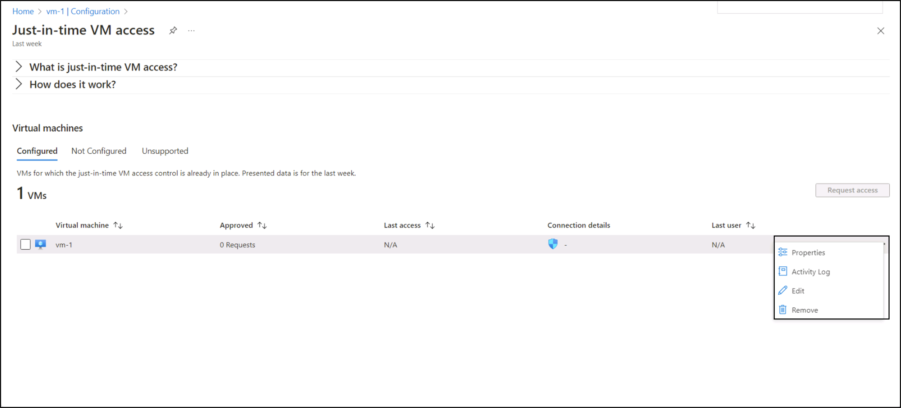

---
lab:
  title: 10 - VM에서 Just-In-Time 액세스 사용
  module: Module 03 - Configure and manage threat protection by using Microsoft Defender for Cloud
---

# 랩 10: VM에서 Just-In-Time 액세스 사용

# 학생용 랩 매뉴얼

## 랩 시나리오

금융 서비스 회사의 Azure 보안 엔지니어는 중요한 애플리케이션을 호스트하는 VM(가상 머신)을 포함하여 Azure 리소스를 보호해야 합니다. 보안 팀은 VM에 대한 지속적인 공개 액세스가 무차별 암호 대입 공격 및 무단 액세스의 위험을 증가시키는 것을 확인했습니다. 이를 완화하기 위해 CISO(최고 정보 보안 책임자)는 재무 트랜잭션을 처리하는 데 사용되는 특정 Azure VM에서 JIT(Just-In-Time) VM 액세스를 사용하도록 요청했습니다.

## 랩 목표

이 랩에서는 다음과 같은 연습을 완료합니다:

- 연습 1: Azure Portal을 통해 VM에서 JIT를 사용하도록 설정합니다.

- 연습 2: Azure Portal을 통해 JIT를 사용하도록 설정한 VM에 대한 액세스를 요청합니다.

## 연습 지침 

### 연습 1: Azure 가상 머신에서 VM에 대해 JIT를 사용하도록 설정합니다.

>**참고**: Azure Portal의 Azure 가상 머신 페이지에서 VM에 대해 JIT를 사용하도록 설정할 수 있습니다.

1. 포털 상단의 검색 상자에 **가상 머신**을 입력합니다. 검색 결과에서 **가상 머신**을 선택합니다.

2. **myVM**을 선택합니다.
 
3. **myVM.** 의 **설정** 섹션에서 **구성**을 선택합니다.
   
4. **Just-In-Time VM 액세스**에서 **Just-In-Time 사용**을 선택합니다.

5. **Just-In-Time VM 액세스**에서 **클라우드용 Microsoft Defender 열기**라고 표시된 링크를 클릭합니다.

6. 기본적으로 VM에 대한 Just-In-Time 액세스는 다음 설정을 사용합니다.

   - Windows 컴퓨터
   
     - RDP 포트: 3389
     - 허용되는 최대 액세스: 3시간
     - 허용된 원본 IP 주소: 임의

   - Linux 컴퓨터
     - SSH 포트: 22
     - 허용되는 최대 액세스: 3시간
     - 허용된 원본 IP 주소: 임의
   
7. 기본적으로 VM에 대한 Just-In-Time 액세스는 다음 설정을 사용합니다.

   - **구성됨** 탭에서 포트를 추가하려는 VM을 마우스 오른쪽 단추로 클릭하고 편집을 선택합니다.

   
   
   - **JIT VM 액세스 구성**에서 포트를 클릭하여 이미 보호된 포트의 기존 설정을 편집하거나 새로운 사용자 지정 포트를 추가할 수 있습니다.
   - 포트 편집이 완료되면 **저장**을 선택합니다.   

### 연습 2: Azure 가상 머신의 연결 페이지에서 JIT 지원 VM에 대한 액세스를 요청합니다.

>**참고**: VM에서 JIT를 사용하도록 설정한 경우 연결에 대한 액세스를 요청해야 합니다. JIT를 사용하도록 설정하는 방법에 관계 없이 지원되는 방법 중 하나를 사용하여 액세스를 요청할 수 있습니다.
   
1. Azure Portal에서 가상 머신 페이지를 엽니다.

2. 연결하려는 VM을 선택하고 **연결** 페이지를 엽니다.

   - Azure는 해당 VM에서 JIT가 사용하도록 설정되어 있는지 확인합니다.

        - VM에 대해 JIT를 사용하도록 설정하지 않은 경우에는 사용하도록 설정하라는 메시지가 표시됩니다.
    
        - JIT를 사용하도록 설정한 경우 **액세스 요청**을 선택하여 요청 IP, 시간 범위 및 해당 VM에 대해 구성된 포트를 사용하여 액세스 요청을 전달합니다.
    
   

> **결과**: VM에서 JIT를 사용하도록 설정하는 방법과 클라우드용 Microsoft Defender에서 JIT를 사용하도록 설정한 VM에 대해 액세스를 요청하는 방법에 대한 다양한 방법을 살펴봤습니다.
